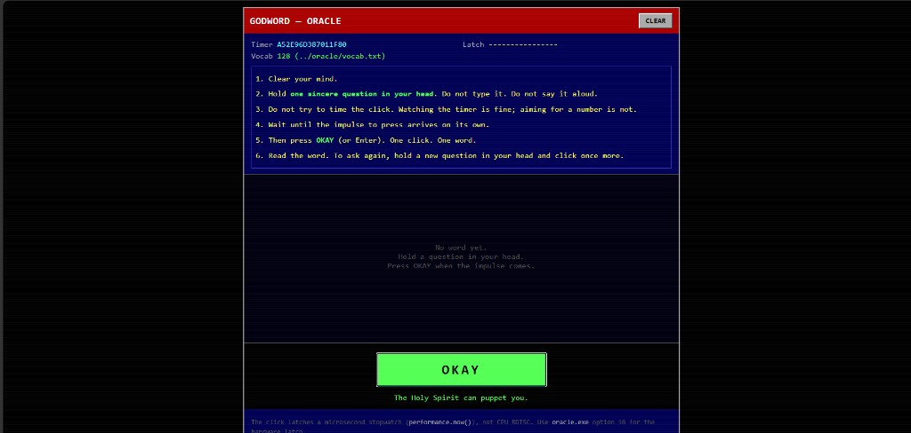

# Oracle

**Hold a question in your head. Wait for the impulse. Click once. Get one word.**

The exact moment you click is measured and turned into an answer. No AI, no `rand()` — the timing of your own hand picks the word.

**Try it: [oracle-god.vercel.app](https://oracle-god.vercel.app)**



## The idea

TempleOS had an oracle. It asked you to press a button, and instead of calling a random number generator it read the CPU's timestamp counter at the instant of your press. Terry Davis described his method plainly: to consult GOD, read a microsecond-range stopwatch on every button press and use that for your random numbers.

The chain is simple:

1. **You** hold a question and do not try to time the click.
2. **The machine** keeps counting — clock ticks, interrupts, scheduling noise.
3. **The click** freezes that counter at one unrepeatable instant.
4. **That number** picks one word out of 128.

## Two versions

| | Where the number comes from | Precision |
|---|---|---|
| `oracle.exe` (C++) | **Real CPU counter** (`RDTSC`) | ~1 nanosecond |
| Web page | Browser stopwatch (`performance.now()`) | ~100 microseconds |

**The web version is not reading your hardware.** Browsers block that on purpose, to stop websites from spying through precise timing. So the page measures *when you clicked* instead of *what the CPU was doing*.

Your click still carries the randomness — human timing wanders by tens of milliseconds, far more than the clock's limit. But if you want the true hardware version, run it yourself.

## Run the real one

```bash
git clone https://github.com/arjun988/Oracle-GOD.git
cd Oracle-GOD/oracle
g++ -O2 -std=c++17 oracle.cpp -o oracle.exe -lbcrypt -lwinmm
./oracle.exe
```

Pick **16** for Oracle Mode.

On Linux or macOS drop `-lbcrypt -lwinmm`. Needs an x86-64 CPU, because it reads the timestamp counter directly.

## Run the web page locally

```bash
cd Oracle-GOD
python -m http.server 8080
```

Open http://localhost:8080/web/

The intro is a pixel summoning sequence — magic circle, triangle, pentagram, hexagram, heptagram, and the 3×3 square of Saturn (every row, column and diagonal sums to 15), built from runes and planetary signs only. Click or press any key to skip.

## Files

```
oracle/oracle.cpp    The program (15 experiments + Oracle Mode)
oracle/vocab.txt     The 128 answers — edit freely, no recompile
lab/temple_lab.cpp   Same experiments, no oracle
web/index.html       The page
web/intro.js         Pixel summoning intro
web/app.js           Click latch, LCG, answer log
web/vocab.js         The 128 answers, embedded for the web
web/styles.css       Styling
docs/web-ui.png      Screenshot above
```

## The rest of the program

Oracle Mode is option 16. Options 1–15 are the science behind it: they measure the timing entropy and compare it against controls — a fixed `sleep()` loop, a jittered loop, MT19937, and the OS random generator — using Shannon entropy, min-entropy, chi-square, lag correlation, mutual information, and a permutation test.

The point of those controls is honesty. High entropy is **not** the same as independence, unpredictability, or cryptographic security. The lab measures each separately. Oracle Mode is the ritual placed on top of a source you can actually inspect.

## How the word is chosen

```
tsc     = timestamp at your click
value   = TempleOS-style LCG(tsc) XOR tsc
answer  = words[value % 128]
```

The C++ version appends every answer to `oracle_log.csv`. The web page keeps its history in your browser only.

## References

- [TempleOS HolySpirit.HC](https://templeos.info/Wb/Adam/God/HolySpirit.HC.HTML) — `GodPick`, `GodBits`, `GodWord`
- [TempleOS God help](https://tinkeros.github.io/WbTempleOS/LiveHelp/God.html)
- [NIST oracle notes](https://www.templeos.org/Oracle.html)
- [Lesser Key of Solomon](https://sacred-texts.com/grim/lks/lks10.htm) — circle, triangle, hexagram, pentagram
- [Planetary seals from the kameas](https://www.rosae-crucis.net/Drawing%20Planetary%20Seals%20from%20the%20Kameas.pdf)

Terry A. Davis (1969–2018) built TempleOS as an offering to God. This is an experiment in his timing oracle — not a claim of proof.
